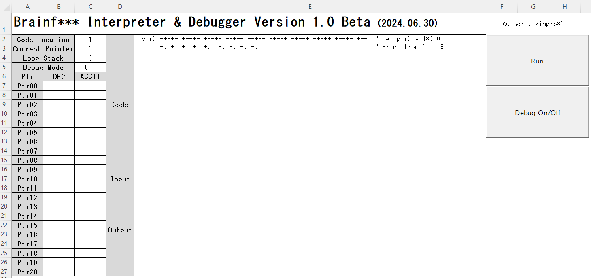
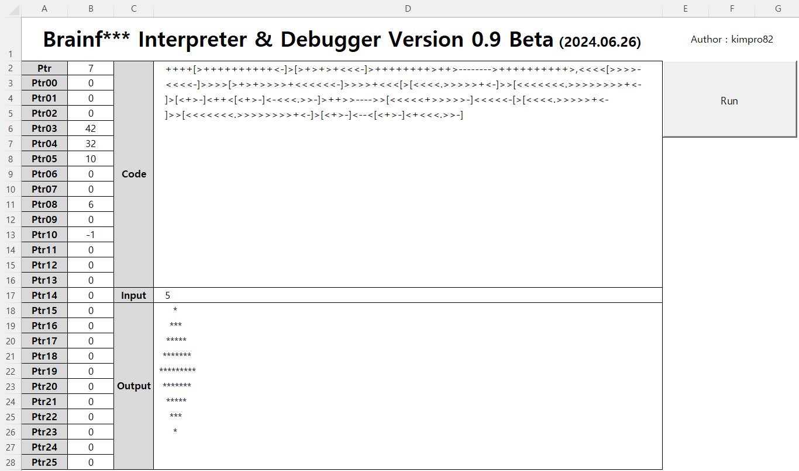

# [My Esolang Interpreters](/README.md#interpreter)

I'm the man who can implement an interpreter of a Turing complete programming language.


### **\<List>**

- [VBA : Brainf*** Interpreter & Debugger Version 1.0 Beta (2024.06.30)](#vba--brainf-interpreter--debugger-version-10-beta-20240630)
- [VBA : Brainf*** Interpreter & Debugger Version 0.9 Beta (2024.06.26)](#vba--brainf-interpreter--debugger-version-09-beta-20240626)


## [VBA : Brainf*** Interpreter & Debugger Version 1.0 Beta (2024.06.30)](#list)

- New Features
  
  - Debugging Support
    - Added an On/Off button to control debugging mode
    - Provided more monitoring items : Code Location, Loop Stack Depth, Debug mode (On/Off), etc.
    - Gradual output and current value of each pointer during debugging
      - Leave the value of unused pointers blank to distinguish from '0'
      - Visualize the executed part of the code by highlighting it in red
    - Clear the output cells when switching between code execution and debugging mode
  - Code Refactoring
    - Declared a unified structure for variables: `BrainfuckState`
    - Separated procedures: `GetBrainfuckState()`, `SetBrainfuckState()`, and `SetErrorState()` from `RunBrainfuck()`
- Code
  <details>
    <summary>BrainfuckInterpreter_1.0_Beta.bas</summary>

  ```vba
  Option Explicit
  ```
  ```vba
  Private state As BrainfuckState
  Private DebugMode As Boolean

  ' Structure to hold Brainfuck interpreter state
  Private Type BrainfuckState

      code As String            ' Brainfuck code to be executed
      inputStr As String        ' Input string for ',' command
      cells(255) As Long        ' Memory cells (up to 256 cells)
      usedPtrs(255) As Boolean  ' Tracks whether each pointer has been used
      ptr As Long               ' Current memory pointer position
      inputPtr As Long          ' Input string pointer
      codePtr As Long           ' Brainfuck code pointer position
      loopStack As Collection   ' Stack to manage loop positions
      output As String          ' Output generated by '.' command
      currentChar As String     ' Current character being processed in the code

  End Type
  ```
  ```vba
  ' Retrieves the initial state of the Brainfuck interpreter
  Private Function GetBrainfuckState() As BrainfuckState

      Dim state As BrainfuckState

      ' Initialize variables
      state.code = Range("E2").Value      ' Brainfuck code from Excel cell E2
      state.inputStr = Range("E17").Value ' Input string from Excel cell E17
      state.ptr = 0
      state.inputPtr = 1
      state.codePtr = 1
      Set state.loopStack = New Collection
      state.output = ""

      ' Initialize usedPtrs array
      Dim i As Long
      For i = 0 To 255
          state.usedPtrs(i) = False
      Next i

      GetBrainfuckState = state

  End Function
  ```
  ```vba
  ' Updates the Excel sheet with the current state of the Brainfuck interpreter
  Private Sub SetBrainfuckState(state As BrainfuckState)

      Dim i As Long
      Dim cell As Range

      ' Print pointer position
      Range("C2").Value = state.codePtr
      Range("C3").Value = state.ptr
      Range("C4").Value = state.loopStack.Count

      ' Print memory cells and their ASCII values
      For i = 0 To 20
          If state.usedPtrs(i) Then
              Range("B7").Offset(i, 0).Value = state.cells(i)
              Range("C7").Offset(i, 0).Value = Chr(state.cells(i))
          Else
              Range("B7").Offset(i, 0).Value = ""
              Range("C7").Offset(i, 0).Value = ""
          End If
      Next i

      ' Print output
      Range("E18").Value = state.output

      ' Highlight the current character in code with special formatting
      If DebugMode Then
          With Range("E2").Characters(1, state.codePtr).Font
              .Color = RGB(255, 0, 0)
          End With
      End If

  End Sub
  ```
  ```vba
  ' Appends error information to the existing error output in Excel cell E18
  Private Sub SetErrorState(codePtr As Long, currentChar As String)

      Range("E18").Value = Range("E18").Value & vbCrLf & vbCrLf & "Error at position: " & codePtr & ", Character: " & currentChar

  End Sub
  ```
  ```vba
  ' Executes the Brainfuck code until completion or a debug break condition
  Private Sub RunBrainfuck()

      On Error GoTo ErrorHandler

      ' Get initial state if not in debug mode or if already finished
      If Not DebugMode Or state.codePtr > Len(state.code) Then
          state = GetBrainfuckState()
      End If

      ' Run Brainfuck code
      Do While state.codePtr <= Len(state.code)
          state.currentChar = Mid(state.code, state.codePtr, 1)
          Select Case state.currentChar
              Case ">"
                  state.ptr = (state.ptr + 1) Mod 256
              Case "<"
                  state.ptr = (state.ptr - 1) Mod 256
              Case "+"
                  state.cells(state.ptr) = (state.cells(state.ptr) + 1) Mod 256
                  state.usedPtrs(state.ptr) = True
              Case "-"
                  state.cells(state.ptr) = (state.cells(state.ptr) - 1) Mod 256
                  state.usedPtrs(state.ptr) = True
              Case "."
                  state.output = state.output & Chr(state.cells(state.ptr))
                  state.usedPtrs(state.ptr) = True
              Case ","
                  If state.inputPtr <= Len(state.inputStr) Then
                      state.cells(state.ptr) = Asc(Mid(state.inputStr, state.inputPtr, 1))
                      state.inputPtr = state.inputPtr + 1
                  Else
                      state.cells(state.ptr) = 0
                  End If
                  state.usedPtrs(state.ptr) = True
              Case "["
                  If state.cells(state.ptr) = 0 Then
                      Dim loopStart As Long
                      loopStart = 1
                      Do While loopStart > 0
                          state.codePtr = state.codePtr + 1
                          If Mid(state.code, state.codePtr, 1) = "[" Then loopStart = loopStart + 1
                          If Mid(state.code, state.codePtr, 1) = "]" Then loopStart = loopStart - 1
                      Loop
                  Else
                      state.loopStack.Add state.codePtr
                  End If
                  state.usedPtrs(state.ptr) = True
              Case "]"
                  If state.cells(state.ptr) <> 0 Then
                      state.codePtr = state.loopStack(state.loopStack.Count)
                  Else
                      state.loopStack.Remove state.loopStack.Count
                  End If
                  state.usedPtrs(state.ptr) = True
          End Select

          state.codePtr = state.codePtr + 1

          ' Check for debug break condition
          If DebugMode Then
              If state.currentChar = "," Or _
                state.currentChar = "." Or _
                (state.currentChar = "]" And state.cells(state.ptr) = 0) Then
                  SetBrainfuckState state
                  Exit Do
              End If
          End If
      Loop

      ' Check if we are done
      If state.codePtr > Len(state.code) Then
          state.output = state.output & vbCrLf & vbCrLf & "Program execution finished."
          Range("E2").Font.Color = RGB(0, 0, 0)
          SetBrainfuckState state
      End If

      Exit Sub

  ErrorHandler:
      SetErrorState state.codePtr, state.currentChar

  End Sub
  ```
  ```vba
  ' Toggles the debug mode on or off
  Private Sub SwitchDebugMode(Optional Mode As Boolean)

      If Not DebugMode Or Mode Then
          DebugMode = True
          Range("C5").Value = "On"
      Else
          state = GetBrainfuckState()
          DebugMode = False
          Range("C5").Value = "Off"
      End If

      state = GetBrainfuckState()
      Range("E2").Font.Color = RGB(0, 0, 0)
      SetBrainfuckState state

  End Sub
  ```
  ```vba
  ' Runs the Brainfuck interpreter when the Run button is clicked
  Private Sub btnRun_Click()

      Application.Calculation = xlManual
      Call RunBrainfuck
      Application.Calculation = xlAutomatic

  End Sub
  ```
  ```vba
  ' Toggles debug mode when the Debug button is clicked
  Private Sub btnDebug_Click()

      SwitchDebugMode

  End Sub
  ```
  </details>


## [VBA : Brainf*** Interpreter & Debugger Version 0.9 Beta (2024.06.26)](#list)

- Features
  
  - Above all, the interpretation of Brainfuck code is successful.
  - The input value requested by the `,` keyword can be applied.
  - Display the values stored in each pointer on the left side of the screen to monitor them(up to 255 pointers can be used).
- Future Improvements
  - Reflect changes in pointer values immediately on the screen during code execution for debugging purposes.
  - Display the corresponding ASCII character for the pointer value.
  - Gradually output intermediate results during the program's progress, not just the final result.
  - Show unused pointer values as empty cells instead of zero.
  - Clear the cells in column `B` that display pointer values and the cell `D18` that displays the execution result when the `Run` button is pressed.
  - Refactor the code.
- Code
  <details>
    <summary>BrainfuckInterpreter_0.9_Beta.bas</summary>

  ```vba
  Option Explicit
  ```
  ```vba
  Private Sub RunBrainfuck()

      ' Declare variables
      Dim code As String
      Dim inputStr As String
      Dim cells(255) As Long
      Dim ptr As Long
      Dim inputPtr As Long
      Dim codePtr As Long
      Dim loopStack As Collection
      Dim i As Long, loopStart As Long, loopEnd As Long
      Dim output As String
      Dim currentChar As String

      On Error GoTo ErrorHandler

      ' Initialize variables
      code = Range("D2").Value
      inputStr = Range("D17").Value
      ptr = 0
      inputPtr = 1
      codePtr = 1
      Set loopStack = New Collection
      output = ""

      ' Run Brainfuck code
      Do While codePtr <= Len(code)
          currentChar = Mid(code, codePtr, 1)
          Select Case currentChar
              Case ">"
                  ptr = (ptr + 1) Mod 256
              Case "<"
                  ptr = (ptr - 1) Mod 256
              Case "+"
                  cells(ptr) = (cells(ptr) + 1) Mod 256
              Case "-"
                  cells(ptr) = (cells(ptr) - 1) Mod 256
              Case "."
                  output = output & Chr(cells(ptr))
              Case ","
                  If inputPtr <= Len(inputStr) Then
                      cells(ptr) = Asc(Mid(inputStr, inputPtr, 1))
                      inputPtr = inputPtr + 1
                  Else
                      cells(ptr) = 0
                  End If
              Case "["
                  If cells(ptr) = 0 Then
                      loopStart = 1
                      Do While loopStart > 0
                          codePtr = codePtr + 1
                          If Mid(code, codePtr, 1) = "[" Then loopStart = loopStart + 1
                          If Mid(code, codePtr, 1) = "]" Then loopStart = loopStart - 1
                      Loop
                  Else
                      loopStack.Add codePtr
                  End If
              Case "]"
                  If cells(ptr) <> 0 Then
                      codePtr = loopStack(loopStack.Count)
                  Else
                      loopStack.Remove loopStack.Count
                  End If
          End Select
          codePtr = codePtr + 1
      Loop

      ' Print output
      Range("B2").Value = ptr
      For i = 0 To 25
          Range("B3").Offset(i, 0).Value = cells(i)
      Next i
      Range("D18").Value = output

      Exit Sub

  ErrorHandler:

      Range("D18").Value = "Error at position: " & codePtr & ", Character: " & currentChar

  End Sub
  ```
  ```vba
  Private Sub btnRun_Click()

      Application.Calculation = xlManual
          Call RunBrainfuck
      Application.Calculation = xlAutomatic

  End Sub
  ```
  </details>
